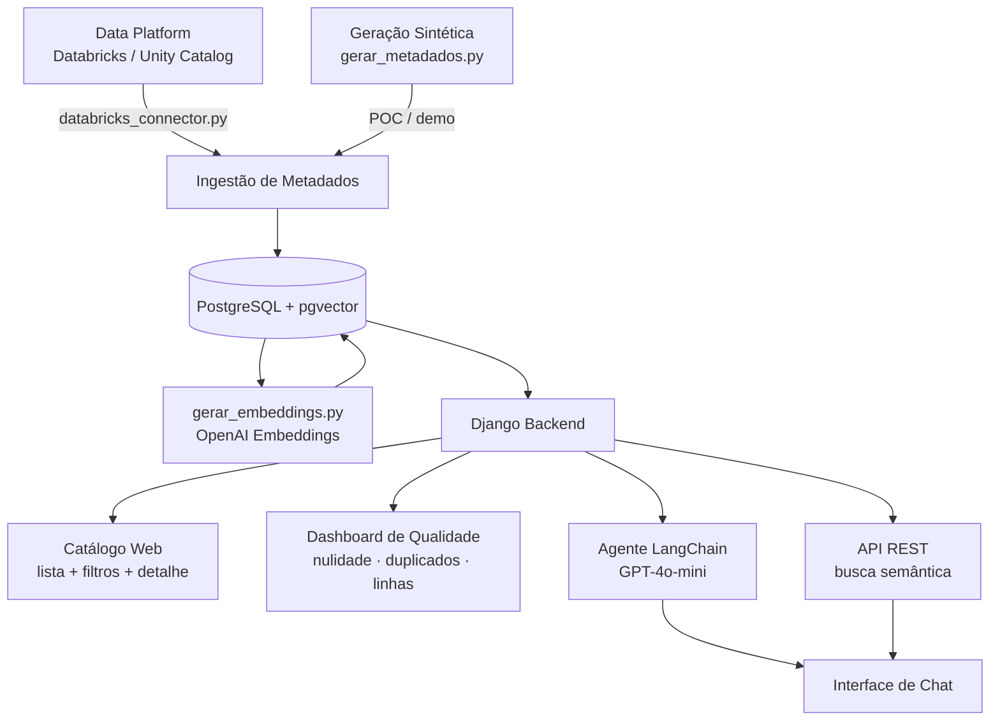

# Data Navigator


**Plataforma de catálogo de metadados com IA** para descoberta autônoma de datasets em ambientes corporativos de dados.

Permite que analistas pesquisem e consultem datasets existentes usando linguagem natural — sem abrir chamados para o time de dados.

> Demo online: https://predict-fill-link-continuity.trycloudflare.com/

---

## O Problema

Ambientes de dados corporativos com centenas de tabelas enfrentam desafios recorrentes:

- Analistas não sabem quais datasets existem
- Metadados incompletos ou desatualizados
- Time de dados sobrecarregado com perguntas repetidas
- Construções duplicadas por falta de visibilidade
- Acesso restrito reduz a autonomia das áreas de negócio

---

## A Solução

O **Data Navigator** centraliza e enriquece metadados com IA, oferecendo:

1. Catálogo web navegável com filtros e ordenação
2. Busca semântica por tema usando embeddings vetoriais
3. Agente conversacional para consulta em linguagem natural
4. Dashboard de qualidade com monitoramento de nulidade e duplicações
5. Atualização de metadados sob demanda (refresh)
6. Connector pronto para integração com Databricks Unity Catalog

---

## Arquitetura



---

## Funcionalidades

### Catálogo de Datasets

Interface web para explorar todas as tabelas disponíveis.

- Filtro por schema
- Ordenação por nome ou data de atualização (mais desatualizada primeiro)
- Badge de qualidade inline (Saudável / Atenção / Crítica)
- Navegação para detalhe completo da tabela

### Detalhe da Tabela

Página dedicada por dataset com:

- Schema completo: nome, tipo e descrição de cada coluna
- Métricas de qualidade com indicação visual por cor
- Data de última atualização
- Botão de **Atualizar Metadados** (refresh sob demanda)

### Dashboard de Qualidade

Visão consolidada de saúde dos dados:

- Cards de resumo: total de tabelas, tabelas críticas, médias de nulidade e duplicação
- Barra de progresso por tabela com código de cor (verde / amarelo / vermelho)
- Critérios: nulos > 15% ou duplicados > 3% = Crítica

### Busca Semântica

Endpoint REST para busca por similaridade vetorial:

```
GET /api/search/?q=dados de vendas por região
```

Retorna as tabelas mais relevantes usando cosine similarity entre embeddings.

### Agente Conversacional

Agente LangChain com GPT-4o-mini e três ferramentas especializadas:

| Tool | Descrição |
|---|---|
| `search_tables` | Busca semântica de datasets por tema |
| `get_schema` | Retorna colunas e tipos de uma tabela |
| `quality_report` | Métricas de qualidade de uma tabela |

Exemplos de perguntas:

```
quais tabelas possuem dados de vendas?
qual o schema da tabela logistics_table_3?
quais datasets estão com alta taxa de nulos?
```

### Connector Databricks Unity Catalog

Script pronto em `ingestao/databricks_connector.py` para integração com a API REST do Unity Catalog.

Para ativar, configure as variáveis de ambiente e execute:

```bash
# Configurar no docker-compose.yml ou .env
DATABRICKS_HOST=https://<workspace>.azuredatabricks.net
DATABRICKS_TOKEN=<personal-access-token>
DATABRICKS_CATALOG=<nome-do-catalogo>

# Executar ingestão
docker exec -it catalog_backend python ingestao/databricks_connector.py
```

> No modo demo atual, os metadados são gerados sinteticamente via `gerar_metadados.py`.

---

## Screenshots

### Home

> _Inserir screenshot da página inicial_

### Catálogo com Filtros

> _Inserir screenshot da listagem com filtro de schema ativo_

### Detalhe da Tabela

> _Inserir screenshot da página de detalhe com métricas de qualidade_

### Dashboard de Qualidade

> _Inserir screenshot do dashboard com barras de progresso coloridas_

### Chat com o Agente

> _Inserir screenshot de uma conversa com o agente_

---

## Stack Tecnológica

| Camada | Tecnologia |
|---|---|
| Backend | Python 3.11, Django, Django REST Framework |
| Banco de dados | PostgreSQL, pgvector |
| IA / LLM | OpenAI (GPT-4o-mini, text-embedding-3-small) |
| Agent framework | LangChain |
| Frontend | Django Templates, Tailwind CSS, HTMX |
| Infraestrutura | Docker, Docker Compose |

---

## Como Rodar

### 1. Clonar o repositório

```bash
git clone <repo>
cd ai-metadata-catalog
```

### 2. Configurar variáveis de ambiente

Crie um arquivo `.env` na raiz com:

```env
OPENAI_API_KEY=sk-...
```

### 3. Subir os containers

```bash
docker-compose up --build
```

### 4. Gerar metadados sintéticos

```bash
docker exec -it catalog_backend python ingestao/gerar_metadados.py
```

### 5. Gerar embeddings para busca semântica

```bash
docker exec -it catalog_backend python ingestao/gerar_embeddings.py
```

### 6. Acessar

| URL | Descrição |
|---|---|
| `http://localhost:8000/` | Home |
| `http://localhost:8000/catalogo/` | Catálogo de datasets |
| `http://localhost:8000/catalogo/qualidade/` | Dashboard de qualidade |
| `http://localhost:8000/chat/` | Chat com o agente |
| `http://localhost:8000/api/search/?q=vendas` | API de busca semântica |

---

## Roadmap

- [x] Catálogo web com navegação e filtros
- [x] Busca semântica por embeddings vetoriais
- [x] Agente conversacional com LangChain
- [x] Dashboard de qualidade (nulidade, duplicações, linhas)
- [x] Refresh de metadados sob demanda
- [x] Connector Databricks Unity Catalog (pronto para integração)
- [ ] Autenticação e controle de acesso por área
- [ ] Scheduler de atualização automática de metadados
- [ ] Lineage: rastreabilidade de dependências entre tabelas
- [ ] Geração automática de descrições com LLM na ingestão

---

## Contexto de Negócio

Este projeto foi desenvolvido para endereçar o desafio de **governança e acessibilidade de metadados** em ambientes corporativos com alto volume de dados — como o Unity Catalog/Data Catalog do Databricks — onde:

- Times de dados recebem dezenas de solicitações repetidas por dia
- Analistas não têm autonomia para descobrir datasets existentes
- Falta visibilidade sobre qualidade e atualização dos dados

O objetivo é reduzir o esforço do time de dados, aumentar a autonomia das áreas de negócio e promover uma cultura data-driven.
